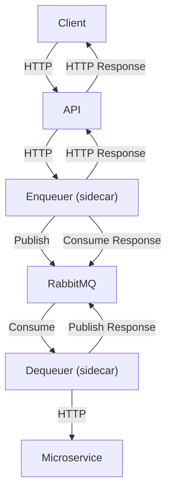
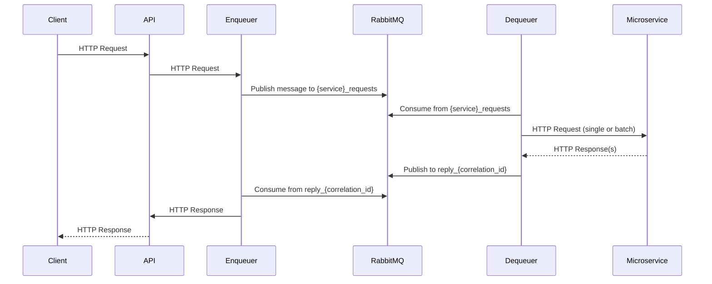

# ProxyMQ: Scalable API-to-Microservice Queueing System

## Purpose

ProxyMQ is a robust, scalable system for decoupling API request handling from downstream microservice processing. It is designed for environments where microservices may be slow to start, have variable processing times (seconds to minutes), and need to scale elastically (e.g., with KEDA in Kubernetes). The system uses RabbitMQ as a message broker, with enqueuer and dequeuer components acting as ambassadors/sidecars to APIs and microservices, respectively.

---

## System Overview

- **Enqueuer**: Sits as a sidecar to the API, receiving HTTP requests and enqueuing them into RabbitMQ. It immediately returns control to the API, allowing it to remain responsive.
- **Dequeuer**: Sits as a sidecar to each microservice instance, pulling requests from RabbitMQ and forwarding them to the microservice for processing. It handles both single and batch processing modes.
- **RabbitMQ**: Acts as the central message broker, providing buffering, durability, and delivery guarantees.

---

## High-Level Architecture

---

## Detailed Request Flow

1. **Client** sends an HTTP request to the API.
2. **API** forwards the request to the **enqueuer** sidecar.
3. **Enqueuer**:
    - Generates a unique `correlation_id` and a temporary reply queue.
    - Publishes the request as a message to RabbitMQ (`{service}_requests` queue), including headers, body, and reply queue info.
    - Waits for a response on the reply queue.
4. **RabbitMQ**:
    - Buffers the request in the appropriate queue.
    - Handles delivery, redelivery, and (optionally) dead-lettering.
5. **Dequeuer**:
    - Consumes messages from the service queue.
    - Forwards each message (or batch) to the microservice via HTTP.
    - Publishes the microservice's response to the reply queue in RabbitMQ.
6. **Enqueuer**:
    - Consumes the response from the reply queue.
    - Returns the response to the API, which returns it to the client.

---

## Sequence Diagram

---

## RabbitMQ Usage

- **Request Queues**: `{service}_requests` (durable, per-service)
- **Reply Queues**: `reply_{correlation_id}` (exclusive, auto-delete, per-request)
- **Message Properties**:
    - `correlation_id`: Uniquely identifies request/response pairs
    - `reply_to`: Specifies the reply queue
    - `headers`: Carries HTTP headers and method info
- **Connection Pooling**: Both enqueuer and dequeuer use connection pools for RabbitMQ

---

## Benefits

- **Decoupling**: API and microservice are fully decoupled, allowing independent scaling and deployment.
- **Buffering**: RabbitMQ absorbs traffic spikes and smooths load.
- **Scalability**: Stateless microservices and sidecars can be scaled horizontally (e.g., with KEDA based on queue length).
- **Resilience**: If a microservice is slow to start or temporarily unavailable, requests are not lost.
- **Batch Processing**: Dequeuer can process messages in batches for efficiency.
- **Backpressure**: Queue length provides natural backpressure and scaling signals.
- **Extensibility**: Easy to add new services by creating new queues.

---

## Trade-offs and Challenges

| Challenge                | Notes/Trade-off                                                                 |
|--------------------------|-------------------------------------------------------------------------------|
| Increased Latency        | Adds queuing and extra hops; not ideal for real-time/low-latency needs         |
| Complexity               | More moving parts (sidecars, queues, reply queues, correlation IDs)            |
| Resource Usage           | Each pod runs an extra sidecar; RabbitMQ must be highly available              |
| Message Ordering         | Not guaranteed unless using a single consumer per queue                        |
| At-least-once Delivery   | Microservices must be idempotent to handle possible duplicate deliveries       |
| Reply Queue Management   | Temporary reply queues must be created and cleaned up per request              |
| Error Handling           | Requires robust error handling and DLQ for failed messages                     |

---

## Extensibility and Enhancements

- **Dead Letter Queues (DLQ):**
    - Configure DLQs for failed messages to prevent loss and enable inspection/replay.
- **Prometheus Metrics:**
    - Instrument enqueuer and dequeuer for request counts, latencies, error rates, etc.
    - Use RabbitMQ Prometheus exporter for queue metrics.
- **Alerting:**
    - Alert on high queue length, error rates, DLQ size, and slow processing.
- **Timeouts and Circuit Breakers:**
    - Set timeouts for all network/queue operations.
    - Use circuit breakers (e.g., pybreaker) to prevent overload and provide fast failure.
- **Batch Processing:**
    - Dequeuer can process messages in batches if the microservice supports it.
- **Security:**
    - Secure RabbitMQ connections, sanitize/validate all inputs, and add authentication as needed.
- **Distributed Tracing:**
    - Use OpenTelemetry or similar for end-to-end request tracing.

---

## When to Use This Pattern

- **Best for:**
    - Workloads where throughput and reliability are more important than low latency
    - Microservices that are slow, stateless, or batch-oriented
    - Systems needing to absorb bursts and scale dynamically
- **Not ideal for:**
    - Real-time, low-latency APIs
    - Workloads requiring strict message ordering

---

## Summary Table

| Property/Scenario         | How This Architecture Handles It         | Notes/Trade-offs                        |
|--------------------------|------------------------------------------|-----------------------------------------|
| Slow microservice start   | Requests wait in queue until ready       | No lost requests, but higher latency    |
| Long processing times     | API is not blocked, queue absorbs load   | Queue can grow large, needs monitoring  |
| Bursty traffic            | Queue smooths spikes, KEDA can scale    | RabbitMQ must be sized for bursts       |
| Stateless scaling         | Dequeuer sidecars scale with service     | Efficient, but more containers per pod  |
| Batch processing          | Dequeuer can batch if microservice can   | Must coordinate batch size, etc.        |
| Immediate response needed | Not ideal—adds latency                   | Use direct call for such endpoints      |
| Failure/retry             | RabbitMQ retries, but may duplicate      | Microservice must be idempotent         |

---

## Getting Started

See the `enqueuer/`, `dequeuer/`, and `url-fetcher/` directories for service code and Dockerfiles. Use `docker-compose.yml` for local development, and see each service's README for details.

---

## Contributing

Contributions are welcome! See `IDEAS.md` for planned enhancements and architectural notes.
